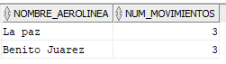

En esta carpeta se encuentra el script con las queries para obtener la información solicitada y los screenshots de las respuestas. E igualmente en este readme se 
encuentran las respuestas 

## Respuestas

### Pregunta 1
#### ¿Cuál es el nombre aeropuerto que ha tenido mayor movimiento durante el año?
Los aeropuertos con Mayor movimiento son 2 La Paz, y Benito Juarez con 2 movimientos cada uno.

